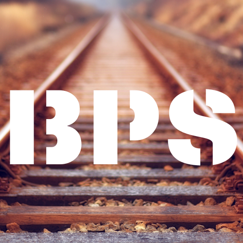

# BPS - bilietų pardavimo sistema

## How to start

<ul>
    <li>Download and install <b>MongoDB Compass Community</b> for database management (<a href="https://www.mongodb.com/try/download/compass">download link</a>)</li>
    <li>Open connection to <i>localhost:27017</i> (default)</li>
    <li>Download and install <b>IntelliJ</b> (<a href="https://www.jetbrains.com/community/education/#students">application for students</a>)</li>
    <li>Pull this code as a new project in IntelliJ/li>
    <li>Set Java 19 as SDK for the project</li>
    <li>Run <i>mvn clean install</i> to download all required dependencies</li>
    <li>Open and run <i>InitialDataTest#createInitialData</i> JUnit test case to set up initial data in MongoDB database (routes, stations, stop schedules)</li>
    <li>Run JavaFX application in <i>BpsApplication</i> class</li>
</ul>
